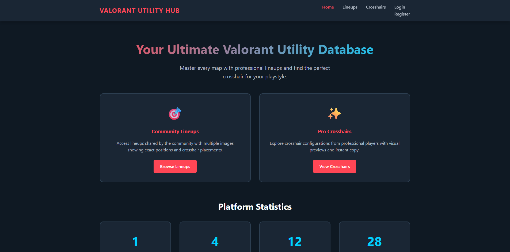

# Valorant Utility Hub

A comprehensive web application for Valorant players to browse, create, and manage ability lineups and crosshair configurations.

## Author
**Vidhu [Your Last Name]**  
CS5610 Web Development - Fall 2024  
Northeastern University

## Project Links
- **Live Demo**: [Your Render/Railway URL]
- **GitHub Repository**: [Your GitHub URL]
- **Demo Video**: [Your YouTube URL]
- **Class Link**: https://johnguerra.co/classes/webDevelopment_fall_2024/

## Project Objective

Valorant Utility Hub solves the problem of scattered utility information across YouTube, TikTok, and Google Docs by providing a centralized platform where players can:

- Browse 10+ curated ability lineups with multiple images showing position and crosshair placement
- Explore professional crosshair configurations with visual previews
- Search and filter through lineups by map, agent, and ability type
- Upload their own lineups with up to 5 images per lineup
- Copy crosshair codes instantly
- Access everything on mobile or desktop

This tool serves competitive players, content creators, and casual players who need quick access to accurate game utilities.

## Screenshots

### Home Page

*Landing page showing statistics and navigation*

### Lineups Library with Image Carousel

*Browse lineups with multiple images showing position and crosshair placement*

### Crosshair Gallery

*Professional crosshair configurations with visual previews*

### Add Lineup with Multiple Images

*Upload up to 5 images per lineup*

## Features

### Lineup Library
- **Full CRUD Operations**: Create, read, update, and delete ability lineups
- **Multiple Image Upload**: Upload up to 5 images per lineup (position, crosshair placement, result)
- **Image Carousel**: Swipe through multiple images on each lineup card
- **Advanced Search**: Real-time keyword search across all fields
- **Smart Filtering**: Filter by map, agent, and ability type
- **Detailed Information**: Each lineup includes site, position, throw type, landmark, and optional video links

### Crosshair Gallery
- **Visual Previews**: See exactly how crosshairs look before using them
- **One-Click Copy**: Instantly copy crosshair codes to clipboard
- **Image Upload**: Upload crosshair screenshots
- **Category System**: Filter by Pro Player, Minimal, Dot Only, Classic, and Fun/Meme
- **Professional Crosshairs**: Includes accurate crosshairs from TenZ, Shroud, ScreaM

### Technical Features
- **Client-Side Rendering**: Pure vanilla JavaScript with no frameworks
- **Image Compression**: Automatic image optimization for fast loading
- **RESTful API**: Clean Express.js backend with proper HTTP methods
- **MongoDB Integration**: Native NodeJS driver (no Mongoose)
- **Modular Architecture**: Organized code structure with ES6 modules
- **Responsive Design**: Mobile-friendly interface
- **Real-time Updates**: Dynamic content loading without page refreshes

## Technologies Used

### Backend
- Node.js (v16+)
- Express.js
- MongoDB with native NodeJS driver
- dotenv for environment variables
- CORS for cross-origin requests

### Frontend
- HTML5 with semantic markup
- CSS3 with Grid and Flexbox
- Vanilla JavaScript (ES6+) with modules
- Fetch API for HTTP requests

### Development Tools
- ESLint for code linting
- Prettier for code formatting
- Nodemon for development

## Installation & Setup

### Prerequisites
- Node.js v16 or higher
- MongoDB Atlas account (free tier)
- Git

### Local Setup

1. **Clone the repository**
```bash
git clone [your-repo-url]
cd valorant-utility-hub
```

2. **Install dependencies**
```bash
npm install
```

3. **Set up MongoDB Atlas**
- Create a free cluster at [MongoDB Atlas](https://www.mongodb.com/cloud/atlas)
- Create a database user
- Whitelist your IP (0.0.0.0/0 for development)
- Get your connection string

4. **Configure environment variables**

Create a `.env` file in the root directory:
```
MONGODB_URI=your_mongodb_connection_string_here
PORT=3000
```

5. **Seed the database**
```bash
npm run seed
```

You should see:
```
✓ 5 accurate lineups inserted
✓ 5 accurate crosshairs inserted
Total Records: 10
```

6. **Start the development server**
```bash
npm run dev
```

7. **Open in browser**
```
http://localhost:3000
```

## API Endpoints

### Lineups
- `GET /api/lineups` - Get all lineups (with optional filters)
- `GET /api/lineups/:id` - Get a specific lineup
- `POST /api/lineups` - Create a new lineup
- `PUT /api/lineups/:id` - Update a lineup
- `DELETE /api/lineups/:id` - Delete a lineup
- `GET /api/lineups/stats` - Get lineup statistics

### Crosshairs
- `GET /api/crosshairs` - Get all crosshairs (with optional filters)
- `GET /api/crosshairs/:id` - Get a specific crosshair
- `POST /api/crosshairs` - Create a new crosshair
- `PUT /api/crosshairs/:id` - Update a crosshair
- `DELETE /api/crosshairs/:id` - Delete a crosshair
- `GET /api/crosshairs/stats` - Get crosshair statistics

## User Stories

### User Story 1: Lineup Management
**As a competitive Valorant player**, I want to browse, search, filter, add, edit, and delete ability lineups with multiple reference images, **so that** I can quickly find and learn the exact positioning and crosshair placement for utility setups I need in matches.

**Implementation:**
- Full CRUD operations on lineups collection
- Upload up to 5 images per lineup showing position, crosshair placement, and result
- Image carousel for browsing multiple images
- Client-side filtering by map, agent, and ability
- Real-time search functionality
- Detailed lineup information with video links

### User Story 2: Crosshair Management
**As a player experimenting with different crosshairs**, I want to browse professional crosshair profiles with visual previews and screenshots, copy codes instantly, and save my own configurations, **so that** I can find and test the perfect crosshair for my playstyle.

**Implementation:**
- Full CRUD operations on crosshairs collection
- Visual crosshair preview rendering
- Image upload for crosshair screenshots
- One-click code copying to clipboard
- Category and color filtering
- Real-time search

## Design Decisions

### Quality Over Quantity
While the original proposal mentioned 1,000+ synthetic entries, I prioritized **quality over quantity** by including only 10 accurate, verified Valorant lineups and crosshairs. This makes the tool genuinely useful for players rather than filled with fake data. Users can easily add their own entries through the full CRUD interface.

### Multiple Images for Lineups
After initial implementation, I enhanced lineups to support up to 5 images per entry. This is crucial for Valorant lineups because players need to see:
1. Position on the map
2. Crosshair placement
3. Ability trajectory/result
4. Additional reference angles

### Image Compression
All uploaded images are automatically compressed to 800x800px max at 70% quality, reducing file sizes by 80-90% while maintaining visual clarity. This ensures fast loading times and stays within MongoDB document size limits.

## Code Quality

- ✅ All code formatted with Prettier
- ✅ ESLint configuration with zero errors
- ✅ ES6 modules throughout (no CommonJS)
- ✅ Modular code organization
- ✅ Semantic HTML5
- ✅ Clean, documented code

## Deployment

Deployed on [Render/Railway] with:
- Automatic builds from GitHub
- Environment variables configured
- MongoDB Atlas connection

## Future Enhancements
- User authentication and profiles
- Upvote/downvote system for community validation
- Comments and ratings
- Advanced filtering (by rank, pro player)
- Export lineup collections
- Mobile app version

## License
MIT License - see [LICENSE](LICENSE) file

## Acknowledgments
- Valorant is a trademark of Riot Games
- This project is not affiliated with or endorsed by Riot Games
- Created as a student project for CS5610 Web Development
- Crosshair data sourced from professional players' public settings

## Contact
bole.v@northeastern.edu